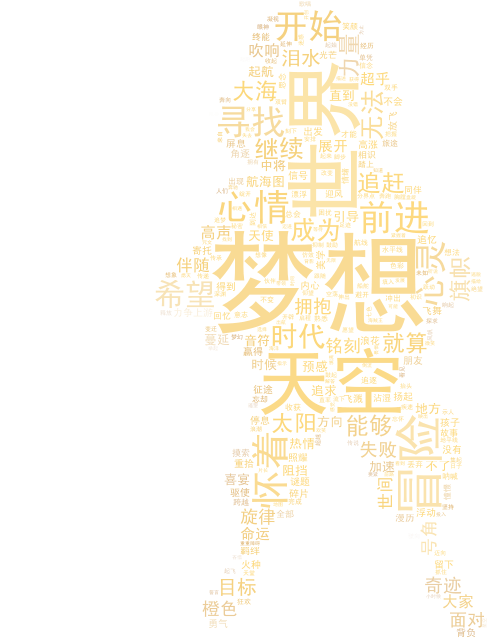
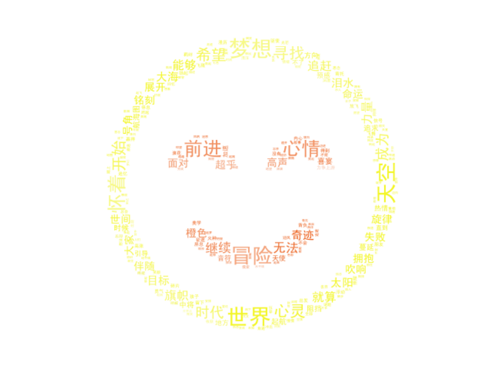

生成图形词云
==========

使用jieba和wordcloud生成图形词云.
其中情感分析部分使用了bosonnlp提供的情感词典[http://bosonnlp.com/dev/resource](http://bosonnlp.com/dev/resource),感谢.

## 安装

    pip install -r requirements.txt

## 使用

*简单显示*

    from words_image import get_keywords, show_image
    import os

    BASE_DIR = os.path.dirname(__file__)
    # 文本文件夹路径
    DATA_DIR = os.path.join(BASE_DIR, "data")
    # 图片文件夹路径
    IMAGE_DIR = os.path.join(BASE_DIR, "images")
    # 源图片路径
    # 其中图片中白色的部分会被忽略
    IMAGE_PATH = os.path.join(IMAGE_DIR, "tony.png")

    if __name__ == "__main__":
        words = get_keywords(DATA_DIR)
        ＃ 显示生成的词图
        show_image(words, IMAGE_PATH)

*批量处理并保存*

    from words_image import get_keywords, save_image
    import os

    BASE_DIR = os.path.dirname(__file__)
    # 文本文件夹路径
    DATA_DIR = os.path.join(BASE_DIR, "data")
    # 图片文件夹路径
    IMAGE_DIR = os.path.join(BASE_DIR, "images")
    # 结果保存路径
    OUTPUT_DIR = os.path.join(BASE_DIR, "output")

    if __name__ == "__main__":
        words = get_keywords(DATA_DIR)
        for image in os.listdir(IMAGE_DIR):
            image_name = os.path.join(IMAGE_DIR, image)
            save_image(words, image_name, OUTPUT_DIR)

*根据情感生成不同表情*

    BASE_DIR = os.path.dirname(__file__)
    WEIBO_DIR = os.path.join(BASE_DIR, 'weibo')
    # 博文路径
    WEIBO_PATH = os.path.join(WEIBO_DIR, 'happy.txt')

    if __name__ == "__main__":
        # 获取博文关键字列表和情感分数
        words, sentiment = get_words_sentiment(WEIBO_PATH)
        # 根据情感分数显示笑脸或悲伤
        show_emotion(words, sentiment)

## 示例

*路飞*

*乔巴*

*动图*

*笑脸*

*伤感*

## 注意

默认安装的images2gif只支持PIL, 不支持Pillow,
需要将:

    for im in images:
        palettes.append( getheader(im)[1] )

修改为:

    for im in images:
        palettes.append( im.palette.getdata()[1] )
